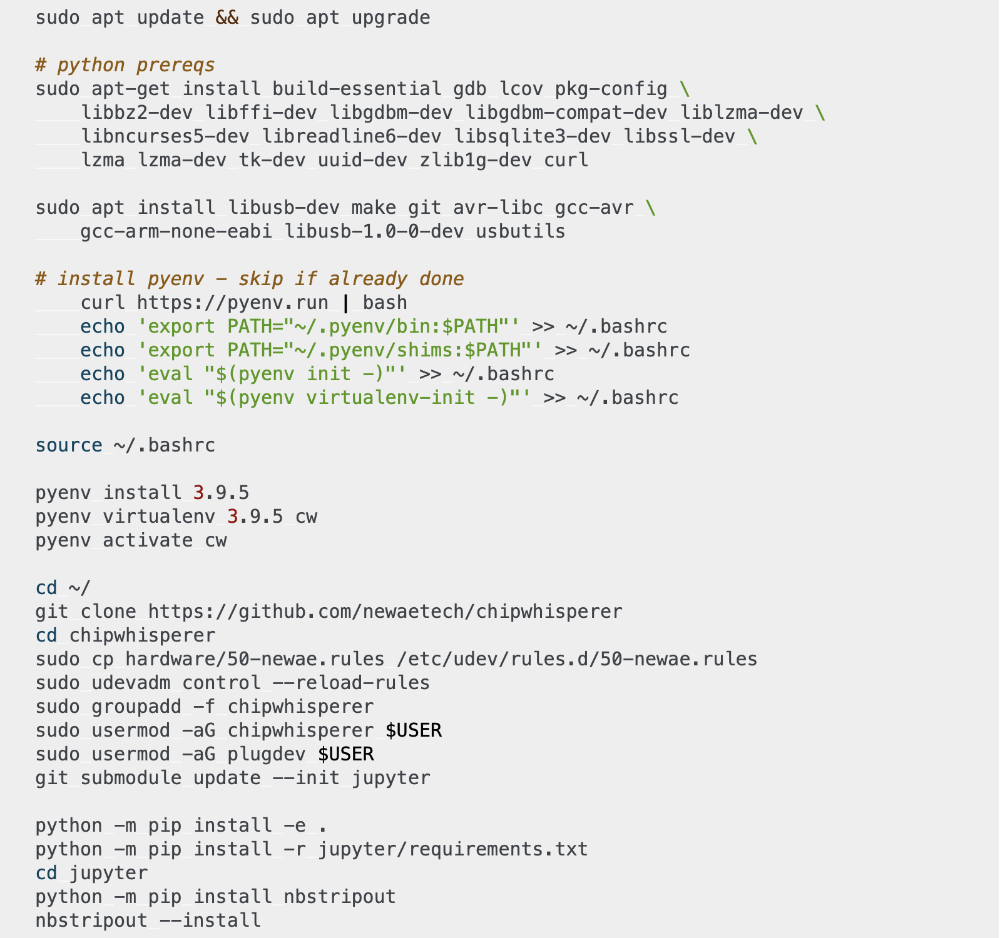

# TPs XLIM Master Cryptis M2
-------------------

* First release: november 2023.

## Development Environment to Set

We will use Jupyter Lab with some open sources libraries. 
Feel free to use other environments like Vstudio Code.

### Requirements

Following libraries are needed:

* `python` > 3.6.
* `Jupyter Lab`: https://jupyterlab.readthedocs.io/en/stable/
* `scared`: https://gitlab.com/eshard/scared/commits/master
* `matplotlib`: https://matplotlib.org
* `sklearn` : https://scikit-learn.org/stable/

Hence, install the following packages:

1. pip install jupyterlab (ou conda install jupyterlab)
2. pip install scared
3. pip install estraces
4. pip install numpy (if not there already)
5. python -m pip install scipy (ou conda install scipy)
6. pip install -U scikit-learn

## Installation of ChipWhisperer-Lite 32-bit
We will use this NewAE board to collect side-channel traces for the trainings.

Install chipWhisperer by following the instruction given there

https://chipwhisperer.readthedocs.io/en/latest/linux-install.html#quick-installation

Run the following commands to install the CWLite (as described in the installation URL given just before.)

 

Remark: during the installation, __IF__ the git clone operation on the 'Jupyter' folder fails (it happens sometimes)
  then clone the repo with:
* > git clone https://github.com/newaetech/chipwhisperer-jupyter.git

  and rename the folder chipwhisperer with
* > mv chipwhisperer-jupyter chipwhisperer

#### Please also install the following libraries with
 
* > pip install chipwhisperer

* > pip install tqdm

* > pip install ipywidgets

* > pip install holoviews

